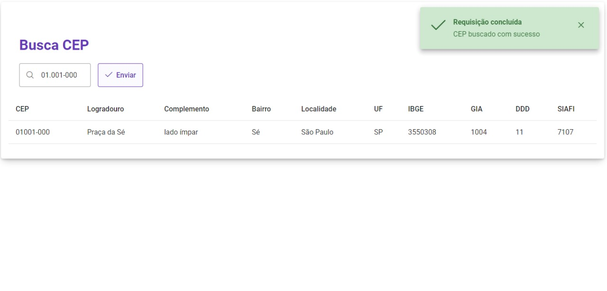

<h1 align="center">Busca CEP</h1>

<div align="center">
    
</div>

<p align="center">Simples aplicação que busca as informações a partir de um cep passado.</p>

<h2>⚠️ Pré-requisitos</h2>
<p>Ferramentas necessárias para rodas a aplicação: <a href="https://git-scm.com">[Git]</a> e <a href="https://nodejs.org/en/">[Node.js]</a>.</p>

<h2>🎲 Rodando a aplicação</h2>

```bash
    # Clone este repositório
    $ git clone https://github.com/ws-ksda/busca-cep

    # Acesse a pasta do projeto
    $ cd busca-cep
    
    # Instale as dependências
    $ npm install
    
    # Execute a aplicação
    $ npm run start

    # Acesse <http://localhost:3000> no seu navegador
```

<h2>🛠 Tecnologias</h2>
<p>
As seguintes ferramentas foram usadas na construção do projeto:

- <a href="https://nodejs.org/en/">[Node.js]</a>
- <a href="https://pt-br.reactjs.org/">[React]</a>
- <a href="https://www.typescriptlang.org/">[TypeScript]</a>

</p>

<h2>👨‍💻 Autor</h2>
<a href="https://github.com/ws-ksda">
    <kbd>
        
    </kbd>
</a>